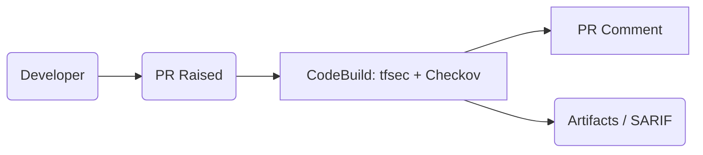

# IaC Scanner Monorepo



## Quick Start

1. Create and activate a virtualenv:
   ```bash
   python -m venv .venv
   source .venv/bin/activate
   ```
2. Install dependencies:
   ```bash
   pip install -r requirements.txt
   ```
3. Install `tfsec` (required):
   ```bash
   curl -sSfL https://raw.githubusercontent.com/aquasecurity/tfsec/master/scripts/install_linux.sh | bash
   ```
4. Run the scanner locally:
   ```bash
   python -m scanner --path iac/terraform/insecure --format json --out artifacts/scan.json --fail-on MEDIUM --tools tfsec,checkov
   ```

## Baseline & Allowlist

- `config/.iac-baseline.json`: approved historic findings. Each entry requires `fingerprint`, optional `expires`, and `reason`.
- `config/.iac-allow.json`: temporary suppressions for new violations. `expires` (ISO8601) is mandatory.
- Use `--baseline-mode lenient` to ignore expiry for investigations.

## Failure Policy

| Highest Fresh Severity | Exit Code | Notes |
| --- | --- | --- |
| CRITICAL/HIGH | 2 | Always fail pipeline |
| MEDIUM | 1 | Fails when `--fail-on` is MEDIUM or lower |
| LOW/INFO | 0 | Pass |

## CodeBuild Integration

- Build spec: `pipeline/buildspec.yml`
- Required IAM permissions for the CodeBuild role:
  - CodeCommit read + `codecommit:PostCommentForPullRequest`
  - S3 artifact bucket read/write
  - CloudWatch Logs write
- Environment variables: `FAIL_ON`, `COMMENT_TARGET`, `BASELINE_MODE`

## GitHub PR Comments (Optional)

- Set `COMMENT_TARGET=github` and supply `GITHUB_TOKEN` via Secrets Manager.
- Use repo identifier `github:owner/repo` and `--pr <number>`.
